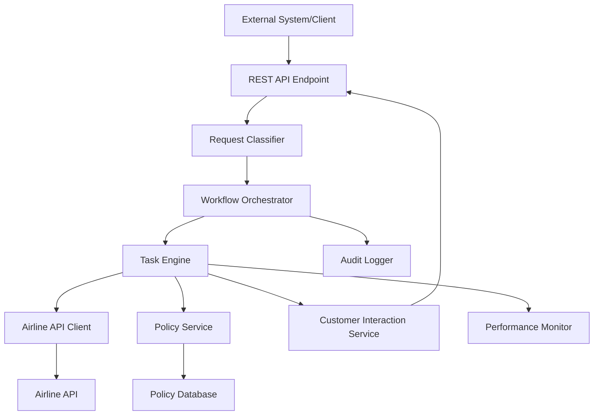
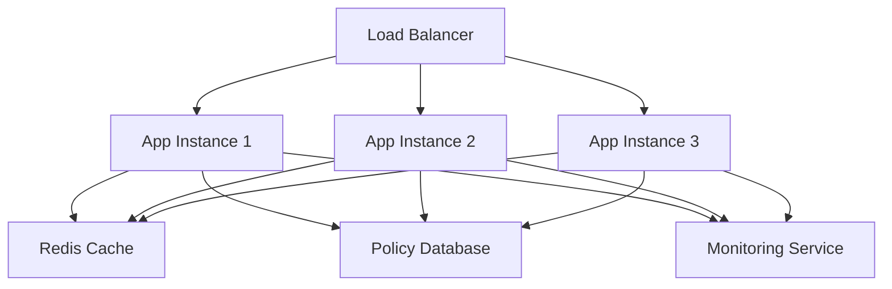

# Design Document - Airline Customer Service System

## Overview

The Airline Customer Service System is a task-based workflow engine that processes customer requests through predefined sequences of operations. The system classifies incoming customer utterances, executes appropriate task workflows, and integrates with external airline APIs and policy databases to provide comprehensive customer service.

The architecture follows a modular, event-driven design that ensures low latency, high availability, and extensibility for future request types and tasks.

## Architecture

### High-Level Architecture



### System Components

1. **REST API Endpoint**: Receives customer queries via HTTP requests and returns responses
2. **Request Classifier**: NLP-based component that categorizes customer utterances
3. **Workflow Orchestrator**: Manages task execution sequences for each request type
4. **Task Engine**: Executes individual tasks (API calls, policy lookups, customer interactions)
5. **Airline API Client**: Handles all external API communications with retry logic
6. **Policy Service**: Retrieves and caches airline policy information
7. **Customer Interaction Service**: Manages multi-turn conversations and data collection via API responses
8. **Audit Logger**: Records all interactions for compliance and monitoring
9. **Performance Monitor**: Tracks latency and availability metrics

## Components and Interfaces

### REST API Endpoint

**Purpose**: Provide HTTP-based interface for receiving customer queries and returning responses.

**Interface**:
```typescript
// Main API endpoint
POST /customer-service/query
{
  "utterance": "I want to cancel my flight",
  "sessionId"?: "optional-session-id",
  "customerId"?: "optional-customer-id"
}

// Response for completed requests (most common case)
{
  "status": "completed",
  "message": "Your flight has been cancelled. Refund amount: $150. Refund date: 2024-01-15",
  "data": {
    "cancellationCharges": 50,
    "refundAmount": 150,
    "refundDate": "2024-01-15"
  }
}

// Response when no specific flight data is available (general information)
{
  "status": "completed",
  "message": "Here is the general cancellation policy. Cancellation fees vary by fare type and timing.",
  "data": {
    "generalPolicy": "Cancellations made 24+ hours before departure incur lower fees...",
    "note": "For specific cancellation details, please include your PNR or flight number in your query"
  }
}

// Error response only for system failures
{
  "status": "error",
  "message": "Unable to process request due to system error",
  "errorCode": "API_UNAVAILABLE"
}
```

### Request Classifier

**Purpose**: Analyze customer utterances using ML-based classification to determine the appropriate request type.

**Recommended Model**: **DistilBERT-based Text Classification**

**Why DistilBERT**:
- **High Accuracy**: Transformer-based architecture with 97%+ accuracy on intent classification
- **Low Latency**: 60% smaller than BERT, processes requests in <100ms
- **Multilingual Support**: Can handle multiple languages if needed
- **Fine-tuning Friendly**: Easy to train on domain-specific airline data
- **Production Ready**: Well-supported with TensorFlow.js/ONNX for deployment

**Interface**:
```typescript
interface RequestClassifier {
  classifyRequest(utterance: string): Promise<ClassificationResult>;
  getConfidenceScore(utterance: string, requestType: RequestType): number;
  trainModel(trainingData: TrainingExample[]): Promise<void>;
  loadModel(modelPath: string): Promise<void>;
}

interface ClassificationResult {
  requestType: RequestType;
  confidence: number;
  alternativeIntents: Array<{type: RequestType, confidence: number}>;
  extractedEntities: ExtractedEntity[];
}

interface ExtractedEntity {
  type: EntityType;
  value: string;
  confidence: number;
  startIndex: number;
  endIndex: number;
}

enum RequestType {
  CANCEL_TRIP = 'cancel_trip',
  CANCELLATION_POLICY = 'cancellation_policy', 
  FLIGHT_STATUS = 'flight_status',
  SEAT_AVAILABILITY = 'seat_availability',
  PET_TRAVEL = 'pet_travel',
  UNKNOWN = 'unknown'
}

enum EntityType {
  PNR = 'pnr',
  FLIGHT_NUMBER = 'flight_number',
  DATE = 'date',
  AIRPORT_CODE = 'airport_code',
  PASSENGER_NAME = 'passenger_name',
  PHONE_NUMBER = 'phone_number',
  EMAIL = 'email'
}
```

**Model Architecture**:
```typescript
interface MLClassifierConfig {
  modelType: 'distilbert' | 'roberta' | 'albert';
  maxSequenceLength: number;
  numLabels: number;
  learningRate: number;
  batchSize: number;
  epochs: number;
}

interface ModelTrainingPipeline {
  preprocessText(utterance: string): string;
  tokenize(text: string): number[];
  augmentData(examples: TrainingExample[]): TrainingExample[];
  trainModel(config: MLClassifierConfig, data: TrainingExample[]): Promise<Model>;
  evaluateModel(model: Model, testData: TrainingExample[]): Promise<ModelMetrics>;
}

interface ModelMetrics {
  accuracy: number;
  precision: Record<RequestType, number>;
  recall: Record<RequestType, number>;
  f1Score: Record<RequestType, number>;
  confusionMatrix: number[][];
}
```

### Workflow Orchestrator

**Purpose**: Coordinate task execution based on request type and manage workflow state.

**Interface**:
```typescript
interface WorkflowOrchestrator {
  executeWorkflow(requestType: RequestType, context: RequestContext): Promise<WorkflowResult>;
  getWorkflowDefinition(requestType: RequestType): TaskDefinition[];
}

interface TaskDefinition {
  taskId: string;
  taskType: TaskType;
  parameters: Record<string, any>;
  dependencies: string[];
}

enum TaskType {
  GET_CUSTOMER_INFO = 'get_customer_info',
  API_CALL = 'api_call',
  POLICY_LOOKUP = 'policy_lookup',
  INFORM_CUSTOMER = 'inform_customer'
}
```

### Task Engine

**Purpose**: Execute individual tasks within workflows with automatic data retrieval.

**Interface**:
```typescript
interface TaskEngine {
  executeTask(task: TaskDefinition, context: TaskContext): Promise<TaskResult>;
  registerTaskHandler(taskType: TaskType, handler: TaskHandler): void;
  autoRetrieveData(requiredData: string[], context: TaskContext): Promise<Record<string, any>>;
}

interface TaskHandler {
  execute(parameters: Record<string, any>, context: TaskContext): Promise<any>;
  getRequiredData(): string[]; // Returns list of required data fields
  canAutoRetrieve(dataField: string): boolean; // Check if data can be retrieved automatically
}

interface AutoDataRetriever {
  retrieveBookingDetails(pnr: string): Promise<BookingDetails>;
  extractPNRFromQuery(utterance: string): string | null;
  extractFlightDetailsFromQuery(utterance: string): Partial<FlightDetails>;
}
```

### Airline API Client

**Purpose**: Manage all interactions with the external airline API.

**Interface**:
```typescript
interface AirlineAPIClient {
  getBookingDetails(pnr: string): Promise<BookingDetails>;
  cancelFlight(bookingDetails: BookingDetails): Promise<CancellationResult>;
  getAvailableSeats(flightInfo: FlightInfo): Promise<SeatAvailability>;
  
  // Enhanced search capabilities for full automation
  searchBookingsByFlight(flightNumber: string, date: Date): Promise<BookingDetails[]>;
  searchBookingsByRoute(route: RouteInfo, date: Date, passengerName?: string): Promise<BookingDetails[]>;
  getFlightsByRoute(from: string, to: string, date: Date): Promise<FlightInfo[]>;
  getFlightByNumber(flightNumber: string, date: Date): Promise<FlightInfo>;
}

interface RouteInfo {
  from: string;
  to: string;
}

interface FlightInfo {
  flight_id: number;
  flight_number: string;
  source_airport_code: string;
  destination_airport_code: string;
  scheduled_departure: Date;
  scheduled_arrival: Date;
  current_status: string;
}

interface BookingDetails {
  pnr: string;
  flight_id: number;
  source_airport_code: string;
  destination_airport_code: string;
  scheduled_departure: Date;
  scheduled_arrival: Date;
  assigned_seat: string;
  current_departure: Date;
  current_arrival: Date;
  current_status: string;
}
```

### Policy Service

**Purpose**: Retrieve and manage airline policy information.

**Interface**:
```typescript
interface PolicyService {
  getCancellationPolicy(flightDetails: FlightDetails): Promise<PolicyInfo>;
  getPetTravelPolicy(): Promise<PolicyInfo>;
  refreshPolicyCache(): Promise<void>;
}

interface PolicyInfo {
  policyType: string;
  content: string;
  lastUpdated: Date;
  applicableConditions: string[];
}
```

### Customer Interaction Service

**Purpose**: Format and deliver automated responses without requiring additional customer input.

**Interface**:
```typescript
interface CustomerInteractionService {
  formatResponse(data: any, format: ResponseFormat): APIResponse;
  createCompletedResponse(message: string, data?: any): APIResponse;
  createErrorResponse(error: string, errorCode?: string): APIResponse;
  logInteraction(request: string, response: APIResponse): void;
}

enum ResponseFormat {
  SIMPLE_MESSAGE = 'simple_message',
  STRUCTURED_DATA = 'structured_data',
  FLIGHT_STATUS = 'flight_status',
  CANCELLATION_RESULT = 'cancellation_result',
  SEAT_AVAILABILITY = 'seat_availability',
  POLICY_INFO = 'policy_info'
}

interface APIResponse {
  status: 'completed' | 'error';
  message: string;
  data?: any;
  errorCode?: string;
  timestamp: Date;
}

// No session management needed - each request is self-contained
interface AutomatedResponseBuilder {
  buildFlightStatusResponse(flightData: any): APIResponse;
  buildCancellationResponse(cancellationResult: any): APIResponse;
  buildSeatAvailabilityResponse(seats: any[]): APIResponse;
  buildPolicyResponse(policyInfo: string): APIResponse;
  buildGeneralInfoResponse(message: string): APIResponse;
}
```

## Data Models

### Core Data Models

```typescript
interface RequestContext {
  sessionId: string;
  customerId?: string;
  requestType: RequestType;
  utterance: string;
  timestamp: Date;
  metadata: Record<string, any>;
}

interface FlightDetails {
  pnr?: string;
  flightNumber?: string;
  departureDate?: Date;
  sourceAirport?: string;
  destinationAirport?: string;
}

interface WorkflowResult {
  success: boolean;
  message: string;
  data?: any;
  executedTasks: string[];
  duration: number;
}

interface TaskResult {
  success: boolean;
  data?: any;
  error?: string;
  duration: number;
}
```

### Workflow Definitions

Each request type follows a predefined task sequence:

**Cancel Trip Workflow**:
1. Extract any available identifiers from customer query (PNR, flight number, etc.)
2. If PNR available, get booking details via API
3. If only flight number available, search bookings via API to find PNR
4. Automatically cancel flight using retrieved booking details
5. Return cancellation confirmation and refund details
6. If both PNR and flight number not available, return a negative response o

**Cancellation Policy Workflow**:
1. Extract any flight identifiers from customer query
2. If identifiers found, automatically get flight details via API
3. If no identifiers, return general cancellation policy
4. Return specific policy information based on flight details

**Flight Status Workflow**:
1. Extract any flight identifiers from customer query
2. Automatically get flight status via API using available identifiers
3. If PNR provided, use booking API; if flight number provided, use flight status API
4. Return current flight status information

**Seat Availability Workflow**:
1. Extract any flight identifiers from customer query
2. Automatically get booking/flight details via appropriate API
3. Automatically get seat availability using retrieved flight information
4. Return available seats information

**Pet Travel Workflow**:
1. Automatically get pet travel policy (no additional data needed)
2. Return policy information

## Error Handling

### API Error Handling Strategy

```typescript
interface APIErrorHandler {
  handleError(error: APIError): Promise<ErrorResponse>;
  shouldRetry(error: APIError): boolean;
  getRetryDelay(attemptNumber: number): number;
}

class ExponentialBackoffRetry {
  private maxRetries = 3;
  private baseDelay = 1000; // 1 second
  
  async executeWithRetry<T>(operation: () => Promise<T>): Promise<T> {
    // Implementation with exponential backoff
  }
}
```

### Error Response Mapping

- **404 Errors**: "Booking/Flight not found. Please verify your details."
- **400 Errors**: "Invalid request. Please check your flight information."
- **500 Errors**: "Service temporarily unavailable. Please try again later."
- **Timeout Errors**: "Request timed out. Please try again."

### Graceful Degradation

- Cache recent policy information for offline access
- Provide estimated information when real-time data is unavailable
- Queue requests during API outages for later processing

## Testing Strategy

### Unit Testing

- **Request Classifier**: Test classification accuracy with various utterance patterns
- **Task Engine**: Test individual task execution with mock dependencies
- **API Client**: Test error handling and retry logic with mock responses
- **Policy Service**: Test policy retrieval and caching mechanisms

### Integration Testing

- **End-to-End Workflows**: Test complete request processing for each request type
- **API Integration**: Test actual API calls with test data
- **Error Scenarios**: Test system behavior under various failure conditions

### Performance Testing

- **Latency Testing**: Verify response times meet requirements (2-5 seconds)
- **Load Testing**: Test system performance under concurrent requests
- **Stress Testing**: Identify system breaking points and recovery behavior

### Test Data Management

```typescript
interface TestDataManager {
  createTestBooking(): BookingDetails;
  createTestFlightDetails(): FlightDetails;
  mockAPIResponses(scenario: TestScenario): void;
}

enum TestScenario {
  SUCCESS = 'success',
  BOOKING_NOT_FOUND = 'booking_not_found',
  API_TIMEOUT = 'api_timeout',
  INVALID_REQUEST = 'invalid_request'
}
```

## Training Dataset Creation Strategy

### Comprehensive Dataset for Request Classification

**Dataset Size Target**: 10,000+ examples (2,000+ per intent class)

**Data Collection Sources**:

1. **Synthetic Data Generation** (40% of dataset)
2. **Real Customer Service Logs** (30% of dataset) 
3. **Crowdsourced Examples** (20% of dataset)
4. **Domain Expert Created** (10% of dataset)

### Intent-Specific Training Examples

**Cancel Trip Intent** (2,000+ examples):
```json
{
  "examples": [
    {"text": "I want to cancel my flight", "intent": "cancel_trip", "entities": []},
    {"text": "Cancel booking ABC123", "intent": "cancel_trip", "entities": [{"type": "pnr", "value": "ABC123", "start": 14, "end": 20}]},
    {"text": "I need to cancel my trip to New York", "intent": "cancel_trip", "entities": [{"type": "destination", "value": "New York", "start": 29, "end": 37}]},
    {"text": "Please cancel flight AA100 on December 15th", "intent": "cancel_trip", "entities": [{"type": "flight_number", "value": "AA100", "start": 20, "end": 25}, {"type": "date", "value": "December 15th", "start": 29, "end": 42}]},
    {"text": "I want to get a refund for my booking", "intent": "cancel_trip", "entities": []},
    {"text": "Cancel my reservation PNR XYZ789", "intent": "cancel_trip", "entities": [{"type": "pnr", "value": "XYZ789", "start": 26, "end": 32}]},
    {"text": "I can't travel anymore, cancel my flight", "intent": "cancel_trip", "entities": []},
    {"text": "Emergency cancellation needed for booking DEF456", "intent": "cancel_trip", "entities": [{"type": "pnr", "value": "DEF456", "start": 42, "end": 48}]},
    {"text": "Refund my ticket", "intent": "cancel_trip", "entities": []},
    {"text": "I want to cancel and get my money back", "intent": "cancel_trip", "entities": []}
  ]
}
```

**Flight Status Intent** (2,000+ examples):
```json
{
  "examples": [
    {"text": "What's my flight status", "intent": "flight_status", "entities": []},
    {"text": "Is flight UA200 on time", "intent": "flight_status", "entities": [{"type": "flight_number", "value": "UA200", "start": 9, "end": 14}]},
    {"text": "Check status of booking GHI789", "intent": "flight_status", "entities": [{"type": "pnr", "value": "GHI789", "start": 24, "end": 30}]},
    {"text": "When does my flight depart", "intent": "flight_status", "entities": []},
    {"text": "Flight status for tomorrow's trip to Miami", "intent": "flight_status", "entities": [{"type": "date", "value": "tomorrow", "start": 18, "end": 26}, {"type": "destination", "value": "Miami", "start": 37, "end": 42}]},
    {"text": "Is my flight delayed", "intent": "flight_status", "entities": []},
    {"text": "Current status of JKL012", "intent": "flight_status", "entities": [{"type": "pnr", "value": "JKL012", "start": 18, "end": 24}]},
    {"text": "Track my flight", "intent": "flight_status", "entities": []},
    {"text": "Flight departure time", "intent": "flight_status", "entities": []},
    {"text": "Has my flight been cancelled", "intent": "flight_status", "entities": []}
  ]
}
```

**Seat Availability Intent** (2,000+ examples):
```json
{
  "examples": [
    {"text": "Show available seats", "intent": "seat_availability", "entities": []},
    {"text": "What seats are free on my flight", "intent": "seat_availability", "entities": []},
    {"text": "Check seat availability for booking MNO345", "intent": "seat_availability", "entities": [{"type": "pnr", "value": "MNO345", "start": 36, "end": 42}]},
    {"text": "I want to change my seat", "intent": "seat_availability", "entities": []},
    {"text": "Available seats in business class", "intent": "seat_availability", "entities": [{"type": "class", "value": "business", "start": 19, "end": 27}]},
    {"text": "Show me window seats", "intent": "seat_availability", "entities": [{"type": "seat_type", "value": "window", "start": 8, "end": 14}]},
    {"text": "Seat map for flight DL500", "intent": "seat_availability", "entities": [{"type": "flight_number", "value": "DL500", "start": 20, "end": 25}]},
    {"text": "Can I upgrade my seat", "intent": "seat_availability", "entities": []},
    {"text": "Empty seats on my flight", "intent": "seat_availability", "entities": []},
    {"text": "Seat selection options", "intent": "seat_availability", "entities": []}
  ]
}
```

**Cancellation Policy Intent** (2,000+ examples):
```json
{
  "examples": [
    {"text": "What's your cancellation policy", "intent": "cancellation_policy", "entities": []},
    {"text": "Cancellation fees for my booking", "intent": "cancellation_policy", "entities": []},
    {"text": "Can I get a refund if I cancel", "intent": "cancellation_policy", "entities": []},
    {"text": "Policy for cancelling flights", "intent": "cancellation_policy", "entities": []},
    {"text": "How much does it cost to cancel", "intent": "cancellation_policy", "entities": []},
    {"text": "Refund policy information", "intent": "cancellation_policy", "entities": []},
    {"text": "What are the cancellation rules", "intent": "cancellation_policy", "entities": []},
    {"text": "Free cancellation period", "intent": "cancellation_policy", "entities": []},
    {"text": "Cancellation terms and conditions", "intent": "cancellation_policy", "entities": []},
    {"text": "When can I cancel without penalty", "intent": "cancellation_policy", "entities": []}
  ]
}
```

**Pet Travel Intent** (2,000+ examples):
```json
{
  "examples": [
    {"text": "Can I bring my pet on the flight", "intent": "pet_travel", "entities": []},
    {"text": "Pet travel policy", "intent": "pet_travel", "entities": []},
    {"text": "Flying with my dog", "intent": "pet_travel", "entities": [{"type": "pet_type", "value": "dog", "start": 16, "end": 19}]},
    {"text": "What are the rules for pets", "intent": "pet_travel", "entities": []},
    {"text": "Pet carrier requirements", "intent": "pet_travel", "entities": []},
    {"text": "Can cats fly in cabin", "intent": "pet_travel", "entities": [{"type": "pet_type", "value": "cats", "start": 4, "end": 8}]},
    {"text": "Pet documentation needed", "intent": "pet_travel", "entities": []},
    {"text": "Service animal policy", "intent": "pet_travel", "entities": [{"type": "pet_type", "value": "service animal", "start": 0, "end": 14}]},
    {"text": "Pet fees and charges", "intent": "pet_travel", "entities": []},
    {"text": "Emotional support animal rules", "intent": "pet_travel", "entities": [{"type": "pet_type", "value": "emotional support animal", "start": 0, "end": 24}]}
  ]
}
```

### Data Augmentation Strategies

**1. Paraphrasing and Synonyms**:
```typescript
interface DataAugmentation {
  paraphraseExamples(examples: string[]): string[];
  addSynonyms(text: string, synonymDict: Record<string, string[]>): string[];
  addTypos(text: string, typoRate: number): string[];
  addNoise(text: string, noiseLevel: number): string[];
}

// Example augmentations:
// "Cancel my flight" → "Cancel my trip", "Cancel my booking", "Cancel my reservation"
// "Flight status" → "Flight info", "Flight details", "Flight update"
```

**2. Entity Variation**:
```typescript
interface EntityVariation {
  generatePNRVariations(): string[]; // ABC123, XYZ789, DEF456, etc.
  generateFlightNumbers(): string[]; // AA100, UA200, DL500, etc.
  generateDates(): string[]; // "tomorrow", "Dec 15", "next week", etc.
  generateAirportCodes(): string[]; // JFK, LAX, ORD, etc.
}
```

**3. Contextual Variations**:
```typescript
// Add context and urgency variations
const contextualVariations = [
  "I need to {action} urgently",
  "Can you help me {action}",
  "I would like to {action}",
  "Please {action}",
  "I want to {action} immediately",
  "Emergency: {action}",
  "Hi, I need to {action}",
  "Hello, can I {action}"
];
```

### Model Training Pipeline

**1. Data Preprocessing**:
```typescript
interface DataPreprocessor {
  cleanText(text: string): string; // Remove special chars, normalize
  tokenize(text: string): string[]; // Split into tokens
  lemmatize(tokens: string[]): string[]; // Reduce to root forms
  removeStopWords(tokens: string[]): string[]; // Remove common words
  addSpecialTokens(tokens: string[]): string[]; // Add [CLS], [SEP] tokens
}
```

**2. Training Configuration**:
```typescript
const trainingConfig = {
  model: 'distilbert-base-uncased',
  maxLength: 128,
  batchSize: 16,
  learningRate: 2e-5,
  epochs: 3,
  warmupSteps: 500,
  weightDecay: 0.01,
  validationSplit: 0.2,
  testSplit: 0.1
};
```

**3. Evaluation Metrics**:
```typescript
interface ModelEvaluation {
  accuracy: number; // Target: >95%
  perClassF1: Record<RequestType, number>; // Target: >90% per class
  confusionMatrix: number[][];
  latency: number; // Target: <100ms
  throughput: number; // Target: >1000 requests/sec
}
```

### Alternative Model Options

**1. Lightweight Options** (for edge deployment):
- **TinyBERT**: 7.5x smaller than BERT, 9.4x faster
- **MobileBERT**: Optimized for mobile/edge devices
- **DistilRoBERTa**: Faster than DistilBERT with similar accuracy

**2. High-Accuracy Options** (for cloud deployment):
- **RoBERTa-base**: Higher accuracy than BERT
- **ELECTRA**: More efficient pre-training, better performance
- **DeBERTa**: State-of-the-art performance on classification tasks

**3. Multilingual Options**:
- **mBERT**: Supports 100+ languages
- **XLM-RoBERTa**: Better multilingual performance
- **DistilmBERT**: Lightweight multilingual option

## Full Automation Strategies

### Required Additional APIs for Complete Automation

To handle queries like "I want to cancel my booking" without any identifiers, the system needs these additional API endpoints:

```typescript
// Additional APIs needed for full automation
interface EnhancedAirlineAPI {
  // Search bookings by customer information
  searchBookingsByCustomer(customerInfo: CustomerSearchInfo): Promise<BookingDetails[]>;
  
  // Get recent bookings for a customer
  getRecentBookings(customerId: string, days: number): Promise<BookingDetails[]>;
  
  // Search bookings by partial information
  searchBookingsByPartialInfo(searchCriteria: PartialSearchCriteria): Promise<BookingDetails[]>;
  
  // Get customer profile and recent activity
  getCustomerProfile(identifier: CustomerIdentifier): Promise<CustomerProfile>;
}

interface CustomerSearchInfo {
  phone?: string;
  email?: string;
  name?: string;
  dateRange?: { from: Date, to: Date };
}

interface CustomerIdentifier {
  phone?: string;
  email?: string;
  customerId?: string;
  loyaltyNumber?: string;
}

interface CustomerProfile {
  customerId: string;
  recentBookings: BookingDetails[];
  upcomingFlights: BookingDetails[];
  preferences: any;
}
```

### Automation Strategies for "I want to cancel my booking"

**Strategy 1: Customer Context Detection**
```typescript
async handleGenericCancellation(utterance: string, customerContext?: any): Promise<CancellationResult> {
  // 1. Try to identify customer from session/context
  if (customerContext?.customerId) {
    const recentBookings = await this.getRecentBookings(customerContext.customerId, 30);
    
    // Auto-select most recent upcoming booking
    const upcomingBooking = recentBookings.find(b => b.scheduled_departure > new Date());
    
    if (upcomingBooking) {
      return await this.cancelBookingAutomatically(upcomingBooking);
    }
  }
  
  // 2. Extract any customer identifiers from utterance
  const customerInfo = this.extractCustomerInfo(utterance);
  if (customerInfo.phone || customerInfo.email) {
    const bookings = await this.searchBookingsByCustomer(customerInfo);
    
    if (bookings.length === 1) {
      // Only one booking found - auto-cancel it
      return await this.cancelBookingAutomatically(bookings[0]);
    } else if (bookings.length > 1) {
      // Multiple bookings - cancel the most recent upcoming one
      const nextBooking = this.selectMostRecentUpcoming(bookings);
      return await this.cancelBookingAutomatically(nextBooking);
    }
  }
  
  // 3. Fallback: Provide helpful guidance
  return this.provideAutomatedGuidance();
}
```

**Strategy 2: Enhanced Information Extraction**
```typescript
interface AdvancedExtractor {
  extractCustomerInfo(utterance: string): CustomerInfo;
  extractContextualClues(utterance: string): ContextualClues;
  inferBookingIntent(utterance: string): BookingIntent;
}

interface CustomerInfo {
  phone?: string;
  email?: string;
  name?: string;
  loyaltyNumber?: string;
}

interface ContextualClues {
  urgency: 'high' | 'medium' | 'low';
  timeframe: 'today' | 'tomorrow' | 'this_week' | 'future';
  travelType: 'business' | 'personal' | 'unknown';
}

// Enhanced extraction examples:
// "I need to cancel my booking urgently" → urgency: high
// "Cancel my flight tomorrow" → timeframe: tomorrow  
// "My name is John Smith, cancel my booking" → name: John Smith
```

**Strategy 3: Intelligent Booking Selection**
```typescript
class AutomatedBookingSelector {
  selectBookingToCancel(bookings: BookingDetails[], context: any): BookingDetails | null {
    // Priority rules for automatic selection:
    
    // 1. If only one upcoming booking - select it
    const upcoming = bookings.filter(b => b.scheduled_departure > new Date());
    if (upcoming.length === 1) return upcoming[0];
    
    // 2. Select booking departing soonest
    if (upcoming.length > 1) {
      return upcoming.sort((a, b) => a.scheduled_departure.getTime() - b.scheduled_departure.getTime())[0];
    }
    
    // 3. If no upcoming bookings, select most recent past booking for refund inquiry
    const past = bookings.filter(b => b.scheduled_departure <= new Date());
    if (past.length > 0) {
      return past.sort((a, b) => b.scheduled_departure.getTime() - a.scheduled_departure.getTime())[0];
    }
    
    return null;
  }
}
```

## Automated Data Retrieval Strategy

### Intelligent Data Extraction

The system automatically extracts and retrieves required information to minimize customer interaction:

**PNR Extraction**:
- Parse customer utterances for PNR patterns (alphanumeric codes)
- Use regex patterns to identify potential PNRs in text
- Validate extracted PNRs by attempting API calls

**Automatic API Chaining**:
```typescript
interface AutomatedWorkflowEngine {
  executeAutomatedWorkflow(requestType: RequestType, initialData: any): Promise<WorkflowResult>;
  chainAPICalls(primaryCall: APICall, dependentCalls: APICall[]): Promise<any>;
}

// Example: Cancel Trip Automation
async cancelTripAutomated(utterance: string): Promise<CancellationResult> {
  // 1. Extract PNR from utterance
  const pnr = this.extractPNR(utterance);
  
  // 2. If PNR found, automatically get booking details
  if (pnr) {
    const booking = await this.airlineAPI.getBookingDetails(pnr);
    
    // 3. Automatically cancel using retrieved booking details
    const cancellation = await this.airlineAPI.cancelFlight(booking);
    
    return cancellation;
  }
  
  // 4. Only ask for PNR if not extractable from utterance
  throw new MissingDataError('pnr_required');
}
```

**Data Dependency Resolution**:
- Map API requirements to available data sources
- Automatically resolve dependencies through API calls
- Only request customer input as last resort

**Fully Automated Data Resolution**:
```typescript
interface FullyAutomatedEngine {
  processRequest(utterance: string, requestType: RequestType): Promise<CompletedResult>;
  extractAllPossibleIdentifiers(utterance: string): FlightIdentifiers;
  resolveFlightData(identifiers: FlightIdentifiers): Promise<FlightData>;
}

interface FlightIdentifiers {
  pnr?: string;
  flightNumber?: string;
  route?: { from: string, to: string };
  date?: Date;
  passengerName?: string;
}

// Fully automated processing - never asks for additional input
async processCancellationRequest(utterance: string): Promise<CancellationResult> {
  // 1. Extract all possible identifiers
  const identifiers = this.extractAllPossibleIdentifiers(utterance);
  
  // 2. Try multiple API strategies to get booking data
  let bookingData = null;
  
  if (identifiers.pnr) {
    // Strategy 1: Use PNR to get booking details
    bookingData = await this.getBookingDetails(identifiers.pnr);
  } else if (identifiers.flightNumber && identifiers.date) {
    // Strategy 2: Search bookings by flight number and date
    bookingData = await this.searchBookingsByFlight(identifiers.flightNumber, identifiers.date);
  } else if (identifiers.route && identifiers.date && identifiers.passengerName) {
    // Strategy 3: Search bookings by route, date, and passenger name
    bookingData = await this.searchBookingsByRouteAndPassenger(identifiers.route, identifiers.date, identifiers.passengerName);
  } else {
    // Strategy 4: Return cancellation policy and instructions
    return {
      status: 'completed',
      message: 'To cancel your booking, you can: 1) Include your PNR in your message, 2) Mention your flight number and date, or 3) Visit our website with your booking reference.',
      data: {
        cancellationPolicy: 'Cancellations made 24+ hours before departure may be eligible for refunds...',
        alternativeOptions: ['Visit website', 'Call customer service', 'Use mobile app']
      }
    };
  }
  
  // 3. If booking found, automatically cancel it
  if (bookingData) {
    const cancellationResult = await this.cancelFlight(bookingData);
    return {
      status: 'completed',
      message: `Booking ${bookingData.pnr} has been cancelled. Refund: $${cancellationResult.refund_amount}`,
      data: cancellationResult
    };
  }
  
  return {
    status: 'completed', 
    message: 'Unable to locate your booking with the provided information. Please include your PNR or flight details for automatic cancellation.'
  };
}

// Enhanced identifier extraction with passenger context
interface EnhancedIdentifierExtractor {
  extractPNR(text: string): string | null;
  extractFlightNumber(text: string): string | null;
  extractRoute(text: string): { from: string, to: string } | null;
  extractDate(text: string): Date | null;
  extractPassengerName(text: string): string | null;
  extractBookingContext(text: string): BookingContext;
}

interface BookingContext {
  hasBookingIntent: boolean;
  hasUrgency: boolean;
  hasPartialInfo: boolean;
  suggestedActions: string[];
}

// Multiple extraction strategies
interface IdentifierExtractor {
  extractPNR(text: string): string | null;
  extractFlightNumber(text: string): string | null;
  extractRoute(text: string): { from: string, to: string } | null;
  extractDate(text: string): Date | null;
  extractPassengerName(text: string): string | null;
}
```

## Performance and Scalability

### Latency Optimization

- **Connection Pooling**: Maintain persistent connections to airline API
- **Response Caching**: Cache policy information and frequent API responses
- **Async Processing**: Use non-blocking I/O for all external calls
- **Request Batching**: Batch multiple API calls when possible

### Monitoring and Metrics

```typescript
interface PerformanceMetrics {
  requestLatency: number;
  apiCallLatency: number;
  policyLookupLatency: number;
  errorRate: number;
  throughput: number;
  availability: number;
}

interface MonitoringService {
  recordMetric(metric: string, value: number): void;
  getMetrics(timeRange: TimeRange): PerformanceMetrics;
  createAlert(condition: AlertCondition): void;
}
```

### Scalability Considerations

- **Horizontal Scaling**: Stateless design allows multiple service instances
- **Database Optimization**: Index policy data for fast retrieval
- **Circuit Breaker**: Prevent cascade failures during API outages
- **Rate Limiting**: Protect against API rate limits and abuse

## Security Considerations

### Data Protection

- **PII Handling**: Encrypt customer data in transit and at rest
- **API Security**: Use secure authentication for airline API access
- **Audit Logging**: Log all customer interactions without exposing sensitive data
- **Session Management**: Implement secure session handling for multi-turn conversations

### Input Validation

- **Utterance Sanitization**: Validate and sanitize customer inputs
- **PNR Validation**: Verify PNR format before API calls
- **Parameter Validation**: Validate all task parameters before execution

## Deployment Architecture

### Service Deployment



### Configuration Management

- **Environment-specific configs**: Development, staging, production
- **Feature flags**: Enable/disable request types and features
- **API endpoints**: Configurable airline API URLs and credentials
- **Performance thresholds**: Configurable latency and retry limits

This design provides a robust, scalable foundation for the airline customer service system that meets all specified requirements while maintaining flexibility for future enhancements.